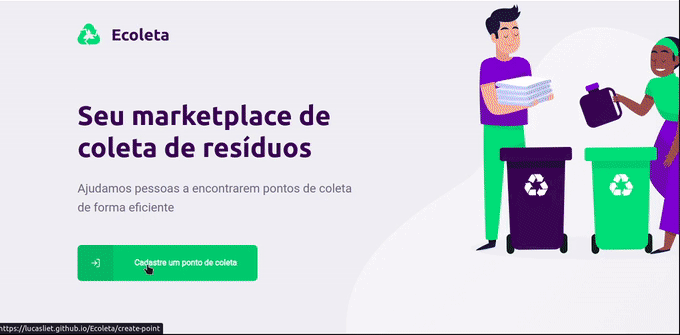
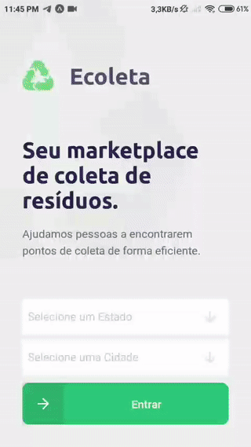

<h1 align="center">
  
</h1>
<p align="center">
  
  
  
  
  
  <br/><br/><br/>
    <a href="https://insomnia.rest/run/?label=Ecoleta&uri=https%3A%2F%2Fraw.githubusercontent.com%2Flucasliet%2FEcoleta%2Fmaster%2F.github%2FEcoleta-Insomnia.json" target="_blank"></a>
</p>

# 📰️ Índice
- [Como usar](#%EF%B8%8F-como-usar)
- [Sobre](#%EF%B8%8F-sobre)
- [Tecnologias Utilizadas](#%EF%B8%8F-tecnologias-utilizadas)
- [Preview](#%EF%B8%8F-preview)
- [Para baixar e reproduzir o projeto](#%EF%B8%8F-para-baixar-e-reproduzir-o-projeto)
- [Como contribuir](#%EF%B8%8F-como-contribuir)
- [Licença](#%EF%B8%8F-licença)
# 📚️ Sobre

Ecoleta é um app web e mobile criado com o intuito de ajudar as pessoas a encontrarem pontos de coleta de reśiduos próximas a elas.

Essa aplicação foi resultado da **Next Level Week** da [Rocketseat.](https://rocketseat.com.br/)

# 👨‍💻️ Tecnologias Utilizadas

O projeto foi desenvolvido utilizando as seguintes tecnologias

- [TypeScript](https://www.typescriptlang.org/)
- [Node.js](https://nodejs.org/en/)
- [ReactJS](https://reactjs.org/)
- [React Native](https://reactnative.dev/)
- [Expo](https://expo.io)
- [Imgur API in Typescript](https://rmp135.github.io/imgur/) - Créditos para [@rmp135](https://github.com/rmp135)

# 🔎️ Preview
> O mockup utilizado para o projeto está disponivel no [Figma](https://www.figma.com/file/0ddDAsoV0iLKlo91KB2kyj/Ecoleta-Lucas?node-id=0%3A1)

## 🖥️ Web Preview


## 📱️ Mobile Preview


# ♻️ Como usar
### 🖥️ Web

> Você pode acessar a versão web pelo link http://lucasliet.github.io/Ecoleta tanto pelo computador quanto pelo celular, ele também é **instalavel como PWA**, adicionando um atalho no celular para abrir como um app
### 📱️ Mobile
>A melhor forma de testar e usar a versão mobile é instalado o app do Expo, infelizmente por enquanto esse suporte **só é fornecido pelo APP android**, porém se [reproduzir o projeto no seu PC](#%EF%B8%8F-para-baixar-e-reproduzir-o-projeto), poderá testar no **iPhone** também :heart:

>[](https://play.google.com/store/apps/details?id=host.exp.exponent&hl=pt-br)

>após abrir o app e clicar em Scan QR Code, aponte a camera para esse QR Code


# ⚙️ Para baixar e reproduzir o projeto

- ### **Pré-requisitos**
  
  - É necessário ter instalado o git, caso esteja no Windows, baixe o [instalador](https://git-scm.com/download/win),no Ubuntu e derivados pode ser instalado com
  ```
  # apt install git -y
  ```

  - É **necessário** possuir o **[Node.js](https://nodejs.org/en/)** instalado
  - Também, é **preciso** ter um gerenciador de pacotes seja o **[NPM](https://www.npmjs.com/)** ou **[Yarn](https://yarnpkg.com/)**.
  - Por fim, é **essencial** ter o **[Expo CLI](https://expo.io/)** instalado de forma global na máquina
  ```
  # yarn add global expo-cli  
  ```
  - Caso **prefira** pode instalar o App do **expo**, no seu [Android](https://play.google.com/store/apps/details?id=host.exp.exponent&hl=pt-br) ou [iPhone](https://apps.apple.com/us/app/expo-client/id982107779), para testar direto do seu celular!

1. **Faça um clone:**

```sh
  $ git clone https://github.com/lucasliet/Ecoleta.git
```

2. **Executando a Aplicação:**

```sh
  # Instale as dependências
  $ yarn install

  ## Crie o banco de dados
  $ cd server
  $ yarn knex:migrate
  $ yarn knex:seed

  # Inicie a API
  $ yarn dev

  # Inicie a aplicação web
  $ cd web
  $ yarn start

  # Inicie a aplicação mobile
  $ cd mobile
  $ yarn start
```
> para iniciar o app mobile leia o QRCode na tela do expo instalado no seu celular, [iPhone](https://apps.apple.com/us/app/expo-client/id982107779) ou [Android](https://play.google.com/store/apps/details?id=host.exp.exponent&hl=pt-br), ou aperte A para rodar direto do emulador se tiver instalado

## 🤝️ Como contribuir

- Faça um Fork desse repositório,
- Crie uma branch com a sua feature: `git checkout -b my-feature`
- Faça um commit com suas mudanças: `git commit -m 'feat: My new feature'`
- Faça um push da sua branch: `git push origin my-feature`
- Abra um Pull Request no github explicando suas mudanças e o motivo para elas

## 📝️ Licença

Esse projeto está sob a licença MIT. Veja o arquivo [LICENSE](LICENSE) para mais detalhes.

<hr/>
<h4 align="center">
    Feito com ❤️ por <a href="https://www.linkedin.com/in/lucas-souza-de-oliveira/" target="_blank">Lucas Souza</a>
</h4>
